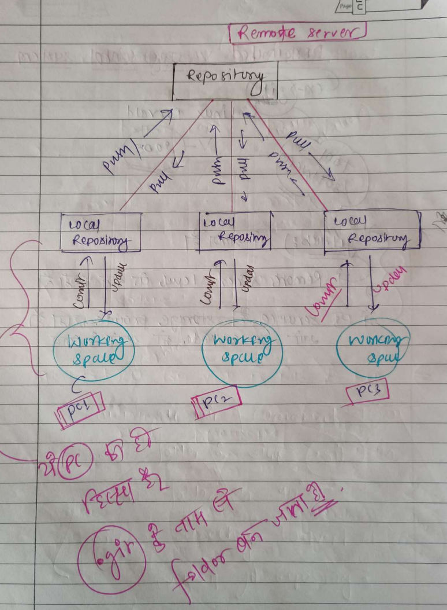
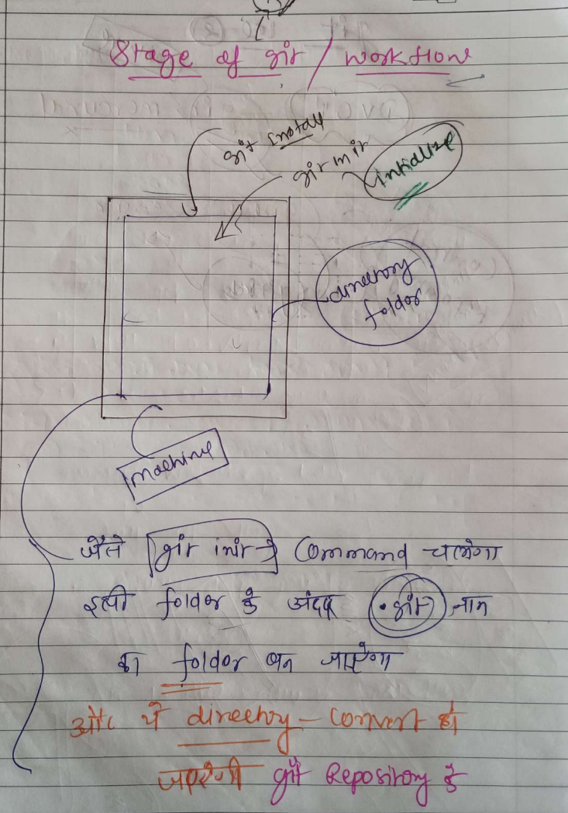

# Complete Node_Js Basic To Advacned 🚀

- [Git download ](https://git-scm.com/downloads)
- [Github](https://github.com/)
- [complete git and GitHub Hand written.pdf](Resources%2Fcomplete%20git%20and%20GitHub%20Hand%20written.pdf)
- [GIT CHEATSHEET-1.pdf](Resources%2FGIT%20CHEATSHEET-1.pdf)
- [Important Git commands every developer must know.pdf](Resources%2FImportant%20Git%20commands%20every%20developer%20must%20know.pdf)
- [Git and Github.pdf](Resources%2FGit%20and%20Github.pdf)
- [Git CheatSheet  v 2 .pdf](Resources%2FGit%20CheatSheet%20%20v%202%20.pdf)
## What is Git?
Git is a version control system that allows developers to track changes made to their code over time. It's a distributed system, meaning that every developer working on a project has a local copy of the entire project history, which makes it easy to collaborate with others.

Git is primarily used for source code management, but it can be used to track changes in any set of files.

## key features of Git:
* Version control: Git allows you to track changes made to your code, so you can easily revert to a previous version if something goes wrong.

* Distributed system: Every developer has a local copy of the project history, making it easy to collaborate with others.

* Branching and merging: Git allows you to create separate branches for different features or releases, and then merge them back into the main branch when they're complete.

## What is GitHub?
GitHub is a web-based platform that provides a centralized location for developers to store and manage their Git repositories.

It's a social coding platform that allows developers to share their code, collaborate with others, and showcase their projects.

## key features of GitHub:
* Repository hosting: GitHub provides a place to store your Git repositories, making it easy to access and manage your code.

* Collaboration tools: GitHub offers features like pull requests, issues, and project management tools to help teams collaborate on projects.

* Open-source community: GitHub is home to a large community of open-source developers, making it easy to find and contribute to open-source projects.

## Authors

- [@Ashutosh kumar](https://github.com/Ashukr321)

## 🔗 Links

##  🐈‍⬛ Git Important Command 🧑‍💻

## Distributed Version Control System 
* A distributed version control system is a type of version control that allows multiple developers to collaborate on a project by creating a local copy of the entire project history, rather than relying on a single central repository. This decentralized approach enables each developer to work independently, and changes are tracked between computers, from one developer's workstation to another.

* Key Features of Distributed Version Control Systems
* Allows users to work productively when not connected to a network
* Common operations (such as commits, viewing history, and reverting changes) are faster
  Multiple copies of the software eliminate reliance on a single backup

* Enables automatic management of branching and merging
  Speeds up most operations (except pushing and pulling)
## Examples of Distributed Version Control Systems
* Git
* Mercurial
* Bazaar
## Basic Architecture 

## Stage of Git and WorkFlow 

## Git Initialization
### Common Use Cases
* Creating a new project and initializing a Git repository from scratch
* Converting an existing project to use Git version control
* Creating a bare repository for sharing or deployment purposes

    git init

### 

## 🚀 About Me
I'm ASHUTOSH KUMAR FULLSTACK DEVELOPER 

I specialize in creating modern and responsive web applications. With a strong passion for FULLSTACK development, I bring creative solutions to life through code and design. Additionally, I am a winner 🏆 of the GDG Patna WEB Hackathon

## Acknowledgements

 * Ashutosh kumar for creating and maintaining this repository.

